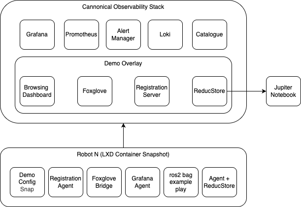

# ros-reductstore-demo

Demonstrate how [ReductStore](https://www.reduct.store) integrates with the [Canonical Observability Stack (COS) Lite](https://charmhub.io/topics/canonical-observability-stack/editions/lite).

See demo's [setup instructions](docs/setup.md) for installing MicroK8s, Juju, COS Lite, ReductStore, and demo applications.

## Demo with Docker Compose

With Docker Compose, you can run a simplified version of the demo on a single machine without Kubernetes:

- http://cloud.reduct.demo
- http://orion.field.demo
- http://atlas.field.demo
- http://nova.field.demo
- http://grafana.reduct.demo
- http://foxglove.reduct.demo
- http://traefik.reduct.demo

To start the demo, run:

```bash
docker compose pull
docker compose up -d
```

To update a certain service only, run:

```bash
docker compose pull <service-name>
docker compose up -d <service-name>
```
If the configuration hasen't changed, you can also use `--force-recreate` to restart a service:

```bash
docker compose up -d --force-recreate <service-name>
```


## Demo with COS Lite and ReductStore

MicroK8s is used to run a local Kubernetes cluster on a single machine (e.g., a laptop or server). Juju is used to deploy and manage applications on the Kubernetes cluster. 

LXD containers simulate multiple robots on the same machine, each running a ROS 2 Foxglove demo application that plays back recorded data.



- **Canonical Observability Stack (COS) Lite** – Monitoring and logging with Grafana, Prometheus, Loki, and Alertmanager.
- **ReductStore** – Time series object storage for MCAP files, images, and telemetry.
- **reductstore_agent** – ROS 2 node for recording and uploading data into ReductStore.
- **Foxglove** – Visualization of live and recorded robot data.
- **Jupyter Notebook** – Example queries and analysis with ReductStore's Python SDK.
- **Browsing Dashboard** – Minimal web demo to explore stored data.
- **Registration Server** – Integrates robots into COS catalogue.


## References

- [ReductStore Documentation](https://reduct.store/docs)
- [Canonical Observability Stack Lite](https://charmhub.io/topics/canonical-observability-stack/editions/lite)
- [ROS 2 Documentation](https://docs.ros.org)
- [Foxglove Studio](https://foxglove.dev)
- [LXD Containers](https://canonical.com/lxd)
